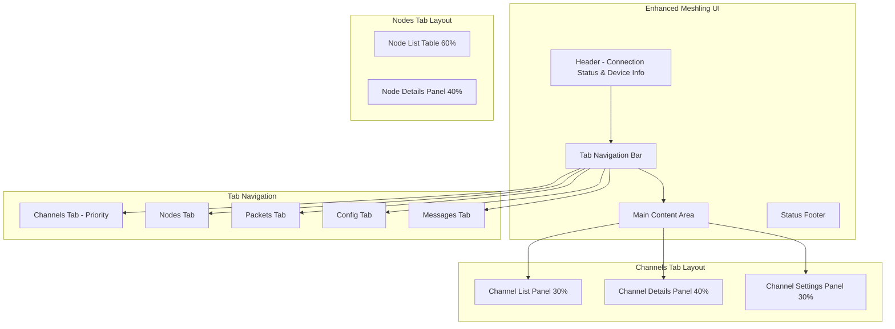
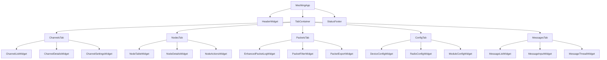
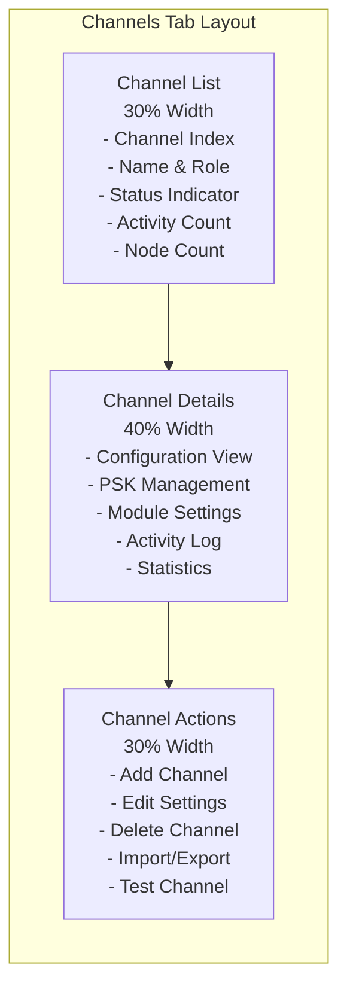
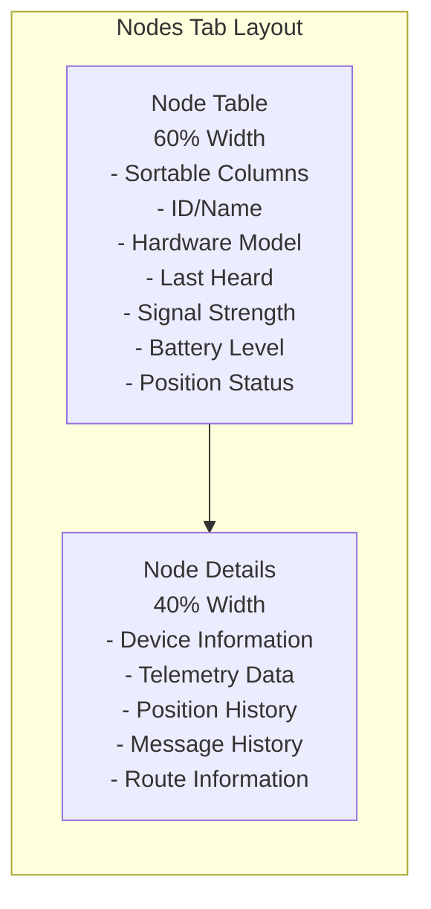
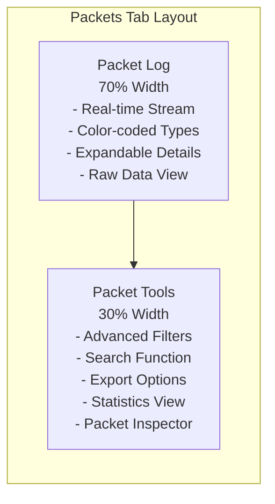
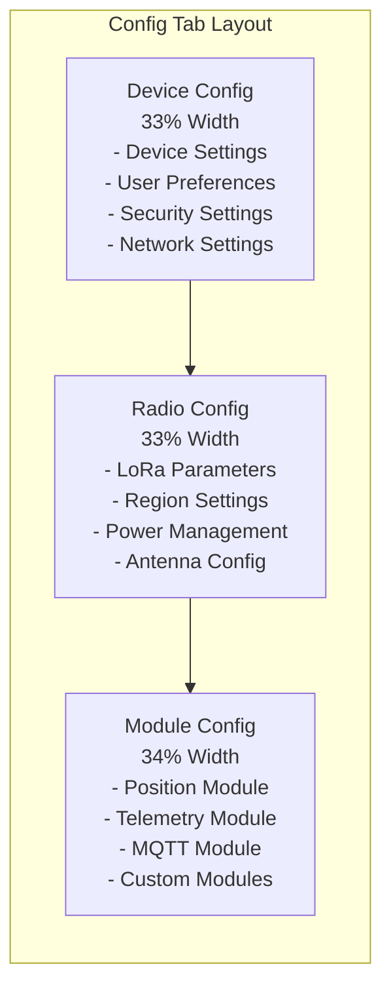
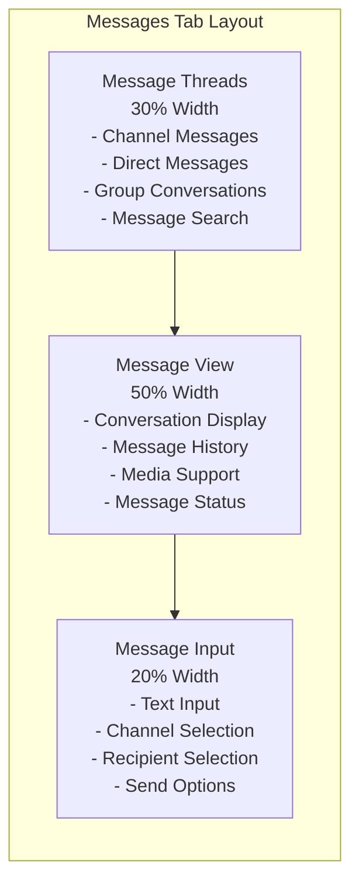

# Enhanced Meshling UI Architecture for Feature Parity

## Executive Summary

This document outlines the architectural design for enhancing Meshling's UI to achieve feature parity with the Meshtastic web UI. The design prioritizes channel management and configuration for multi-channel setups while providing comprehensive node management, advanced packet monitoring, and device configuration capabilities.

## Current State Analysis

### Existing Architecture Strengths
- Solid event-driven foundation with [`EventBus`](meshling/core/event_bus.py:49)
- Working connection management via [`ConnectionManager`](meshling/core/connection_manager.py:18)
- Basic packet handling and display in [`PacketLogWidget`](meshling/app.py:18)
- Textual framework with CSS styling support
- Async architecture for non-blocking operations

### Current Limitations
- Single-view layout (packet log + basic controls)
- No channel management capabilities
- Limited node information display (only count)
- Basic packet filtering and display
- No device configuration interface
- No support for hundreds of nodes scenario

## Enhanced UI Architecture Design

### 1. Overall Layout Structure



### 2. Component Hierarchy



## Data Models

### Channel Data Model
```python
@dataclass
class ChannelInfo:
    index: int
    name: str
    role: str  # PRIMARY, SECONDARY, DISABLED
    psk: Optional[str]
    uplink_enabled: bool
    downlink_enabled: bool
    module_settings: Dict[str, Any]
    last_activity: Optional[datetime]
    message_count: int
    active_nodes: List[str]
    encryption_enabled: bool
    
class ChannelManager:
    async def get_channels(self) -> List[ChannelInfo]
    async def create_channel(self, config: ChannelConfig) -> bool
    async def update_channel(self, index: int, config: ChannelConfig) -> bool
    async def delete_channel(self, index: int) -> bool
    async def import_channels(self, config_data: str) -> bool
    async def export_channels(self) -> str
```

### Node Data Model
```python
@dataclass
class NodeInfo:
    node_id: str
    short_name: str
    long_name: str
    hardware_model: str
    firmware_version: str
    last_heard: datetime
    snr: float
    rssi: float
    battery_level: Optional[int]
    position: Optional[Position]
    telemetry: Optional[Telemetry]
    hops_away: int
    is_neighbor: bool
    via_mqtt: bool
    public_key: Optional[str]
    
class NodeManager:
    async def get_nodes(self) -> List[NodeInfo]
    async def get_node_details(self, node_id: str) -> NodeInfo
    async def request_position(self, node_id: str) -> bool
    async def request_telemetry(self, node_id: str) -> bool
    async def send_direct_message(self, node_id: str, message: str) -> bool
```

### Enhanced Packet Model
```python
@dataclass
class PacketInfo:
    id: str
    timestamp: datetime
    from_node: str
    to_node: str
    channel: int
    packet_type: str
    payload: Dict[str, Any]
    snr: float
    rssi: float
    hop_limit: int
    want_ack: bool
    via_mqtt: bool
    decoded_text: Optional[str]
    raw_data: bytes
    
class PacketFilter:
    node_filter: Optional[str] = None
    channel_filter: Optional[int] = None
    packet_type_filter: Optional[str] = None
    time_range: Optional[Tuple[datetime, datetime]] = None
    text_search: Optional[str] = None
```

## Tab-Specific Designs

### Channels Tab (Priority Focus)



**Key Features:**
- **Channel List Panel**: Real-time channel status with activity indicators
- **Channel Configuration**: Complete channel settings editor
- **PSK Management**: Secure key generation and management
- **Module Integration**: LoRa, Position, Telemetry module settings per channel
- **Import/Export**: Channel configuration backup/restore
- **Activity Monitoring**: Real-time channel usage statistics

**Channel Management Workflows:**
1. **Multi-Channel Setup**: Create and configure multiple channels for different purposes
2. **Security Management**: Set up encryption keys and access controls
3. **Performance Tuning**: Optimize channel settings for network conditions
4. **Backup/Restore**: Export/import channel configurations

### Nodes Tab



**Key Features:**
- **Scalable Node Table**: Handle hundreds of nodes with pagination/filtering
- **Real-time Updates**: Live signal strength and battery monitoring
- **Node Actions**: Direct messaging, position requests, telemetry requests
- **Route Tracing**: Mesh network path visualization
- **Historical Data**: Position and telemetry history tracking

### Enhanced Packets Tab



**Key Features:**
- **Advanced Filtering**: Multi-criteria packet filtering
- **Search Capability**: Full-text search through packet history
- **Export Functions**: CSV, JSON, raw binary export
- **Packet Analysis**: Detailed packet inspection and statistics
- **Performance Monitoring**: Network health metrics

### Config Tab



**Key Features:**
- **Complete Device Configuration**: All device parameters accessible
- **Radio Optimization**: LoRa parameter tuning for optimal performance
- **Module Management**: Enable/disable and configure modules
- **Configuration Backup**: Save/restore device configurations

### Messages Tab



## Event System Extensions

### New Event Types
```python
class EventType(Enum):
    # Channel events
    CHANNEL_LIST_UPDATED = "channel_list_updated"
    CHANNEL_SETTINGS_CHANGED = "channel_settings_changed"
    CHANNEL_ACTIVITY = "channel_activity"
    CHANNEL_CREATED = "channel_created"
    CHANNEL_DELETED = "channel_deleted"
    
    # Node events  
    NODE_LIST_UPDATED = "node_list_updated"
    NODE_INFO_UPDATED = "node_info_updated"
    NODE_POSITION_UPDATED = "node_position_updated"
    NODE_TELEMETRY_UPDATED = "node_telemetry_updated"
    NODE_BATTERY_UPDATED = "node_battery_updated"
    
    # UI events
    TAB_CHANGED = "tab_changed"
    FILTER_APPLIED = "filter_applied"
    EXPORT_REQUESTED = "export_requested"
    SEARCH_PERFORMED = "search_performed"
    
    # Configuration events
    CONFIG_UPDATED = "config_updated"
    CONFIG_EXPORTED = "config_exported"
    CONFIG_IMPORTED = "config_imported"
```

### Event Data Structures
```python
@dataclass
class ChannelEvent:
    channel_index: int
    channel_name: str
    event_type: str
    data: Dict[str, Any]
    timestamp: datetime

@dataclass
class NodeEvent:
    node_id: str
    event_type: str
    data: Dict[str, Any]
    timestamp: datetime
```

## Implementation Roadmap

### Phase 1: Core Tab Infrastructure (Week 1-2)
**Objective**: Establish tab-based navigation foundation

**Tasks**:
1. **Tab Container System**
   - Create [`TabContainer`](meshling/ui/widgets/common/tab_container.py) widget
   - Implement [`BaseTab`](meshling/ui/widgets/tabs/base_tab.py) abstract class
   - Update [`MeshlingApp`](meshling/app.py) layout

2. **Enhanced Header**
   - Expand [`HeaderWidget`](meshling/ui/widgets/header.py) with device info
   - Add connection quality indicators
   - Implement real-time status updates

3. **Navigation Logic**
   - Tab switching mechanism
   - State preservation between tabs
   - Keyboard shortcuts for tab navigation

**Deliverables**: Working tab navigation with placeholder content

### Phase 2: Channels Tab Implementation (Week 3-4) - PRIORITY
**Objective**: Complete channel management functionality

**Tasks**:
1. **Channel Management Core**
   - Implement [`ChannelListWidget`](meshling/ui/widgets/channel/channel_list.py)
   - Create [`ChannelDetailsWidget`](meshling/ui/widgets/channel/channel_details.py)
   - Build [`ChannelSettingsWidget`](meshling/ui/widgets/channel/channel_settings.py)

2. **Channel Data Integration**
   - Extend [`ConnectionManager`](meshling/core/connection_manager.py) for channel operations
   - Add [`ChannelManager`](meshling/core/channel_manager.py) class
   - Implement channel configuration APIs

3. **Channel Features**
   - PSK generation and management
   - Channel import/export functionality
   - Real-time activity monitoring
   - Module-specific settings interface

**Deliverables**: Fully functional channel management with all CRUD operations

### Phase 3: Nodes Tab Implementation (Week 5-6)
**Objective**: Comprehensive node management for large networks

**Tasks**:
1. **Node Management UI**
   - Create [`NodeTableWidget`](meshling/ui/widgets/node/node_table.py) with sorting/filtering
   - Implement [`NodeDetailsWidget`](meshling/ui/widgets/node/node_details.py)
   - Build [`NodeActionsWidget`](meshling/ui/widgets/node/node_actions.py)

2. **Node Data Pipeline**
   - Add [`NodeManager`](meshling/core/node_manager.py) class
   - Enhance node information collection
   - Implement position and telemetry tracking
   - Add node statistics and history

3. **Scalability Features**
   - Pagination for large node lists
   - Advanced filtering and search
   - Performance optimization for hundreds of nodes

**Deliverables**: Scalable node management supporting hundreds of nodes

### Phase 4: Enhanced Packets Tab (Week 7)
**Objective**: Advanced packet monitoring and analysis

**Tasks**:
1. **Enhanced Packet Display**
   - Upgrade [`PacketLogWidget`](meshling/ui/widgets/packet_log.py) to [`EnhancedPacketLogWidget`](meshling/ui/widgets/packets/enhanced_packet_log.py)
   - Add [`PacketFilterWidget`](meshling/ui/widgets/packets/packet_filter.py)
   - Create [`PacketExportWidget`](meshling/ui/widgets/packets/packet_export.py)

2. **Advanced Features**
   - Multi-criteria filtering system
   - Full-text search capability
   - Export to multiple formats
   - Packet statistics and analysis

**Deliverables**: Professional-grade packet monitoring with analysis tools

### Phase 5: Config Tab Implementation (Week 8)
**Objective**: Complete device configuration interface

**Tasks**:
1. **Configuration UI**
   - Implement [`DeviceConfigWidget`](meshling/ui/widgets/config/device_config.py)
   - Create [`RadioConfigWidget`](meshling/ui/widgets/config/radio_config.py)
   - Build [`ModuleConfigWidget`](meshling/ui/widgets/config/module_config.py)

2. **Configuration Management**
   - Add [`ConfigManager`](meshling/core/config_manager.py) class
   - Implement configuration backup/restore
   - Add validation and error handling

**Deliverables**: Complete device configuration management

### Phase 6: Messages Tab Implementation (Week 9)
**Objective**: Enhanced messaging interface

**Tasks**:
1. **Message Management**
   - Create [`MessageListWidget`](meshling/ui/widgets/messages/message_list.py)
   - Implement [`MessageThreadWidget`](meshling/ui/widgets/messages/message_thread.py)
   - Enhance [`MessageInputWidget`](meshling/ui/widgets/messages/message_input.py)

2. **Message Features**
   - Thread-based conversations
   - Message search and filtering
   - Direct messaging interface

**Deliverables**: Comprehensive messaging interface

### Phase 7: Polish & Integration (Week 10)
**Objective**: Production-ready UI with optimal UX

**Tasks**:
1. **Styling & UX**
   - Update [`main.tcss`](meshling/ui/styles/main.tcss) for new layout
   - Implement responsive design
   - Add comprehensive keyboard shortcuts
   - Optimize performance

2. **Testing & Documentation**
   - Comprehensive testing with real devices
   - Performance optimization for large networks
   - User documentation updates
   - Integration testing

**Deliverables**: Production-ready enhanced UI

## File Structure Extensions

```
meshling/ui/
├── widgets/
│   ├── tabs/
│   │   ├── __init__.py
│   │   ├── base_tab.py           # Base tab widget class
│   │   ├── channels_tab.py       # Channel management tab
│   │   ├── nodes_tab.py          # Node management tab  
│   │   ├── packets_tab.py        # Enhanced packet tab
│   │   ├── config_tab.py         # Device configuration tab
│   │   └── messages_tab.py       # Message management tab
│   ├── channel/
│   │   ├── __init__.py
│   │   ├── channel_list.py       # Channel list widget
│   │   ├── channel_details.py    # Channel details panel
│   │   └── channel_settings.py   # Channel configuration
│   ├── node/
│   │   ├── __init__.py
│   │   ├── node_table.py         # Node table widget
│   │   ├── node_details.py       # Node details panel
│   │   └── node_actions.py       # Node action buttons
│   ├── packets/
│   │   ├── __init__.py
│   │   ├── enhanced_packet_log.py # Enhanced packet display
│   │   ├── packet_filter.py      # Packet filtering
│   │   └── packet_export.py      # Export functionality
│   ├── config/
│   │   ├── __init__.py
│   │   ├── device_config.py      # Device configuration
│   │   ├── radio_config.py       # Radio settings
│   │   └── module_config.py      # Module configuration
│   ├── messages/
│   │   ├── __init__.py
│   │   ├── message_list.py       # Message threads
│   │   ├── message_thread.py     # Conversation view
│   │   └── message_input.py      # Enhanced message input
│   └── common/
│       ├── __init__.py
│       ├── tab_container.py      # Tab navigation container
│       ├── data_table.py         # Reusable data table
│       ├── filter_panel.py       # Common filter widget
│       └── export_dialog.py      # Export functionality

meshling/core/
├── channel_manager.py            # Channel operations
├── node_manager.py               # Node management
├── config_manager.py             # Configuration management
└── packet_manager.py             # Enhanced packet handling
```

## Styling Strategy

### CSS Theme Extensions
```css
/* Tab Navigation */
.tab-container {
    dock: top;
    height: 3;
    background: $surface;
    border-bottom: solid $primary;
}

.tab-button {
    background: transparent;
    color: $text-muted;
    border: none;
    padding: 0 3;
    margin: 0 1;
}

.tab-button.-active {
    background: $primary;
    color: $text;
    border-bottom: solid 2 $accent;
}

.tab-button:hover {
    background: $surface-lighten-1;
    color: $text;
}

/* Channel Management */
.channel-list {
    width: 30%;
    border: solid $primary;
    scrollbar-gutter: stable;
}

.channel-details {
    width: 40%;
    border: solid $primary;
    margin: 0 1;
}

.channel-settings {
    width: 30%;
    border: solid $primary;
}

.channel-item {
    padding: 1;
    border-bottom: solid $surface-lighten-1;
}

.channel-item:hover {
    background: $surface-lighten-1;
}

.channel-item.-active {
    background: $primary;
    color: $text;
}

/* Node Table */
.node-table {
    scrollbar-gutter: stable;
    border: solid $primary;
}

.node-row:hover {
    background: $surface-lighten-1;
}

.node-row.-selected {
    background: $primary;
    color: $text;
}

/* Status Indicators */
.status-online {
    color: $success;
}

.status-offline {
    color: $error;
}

.status-unknown {
    color: $warning;
}

/* Signal Strength */
.signal-excellent {
    color: $success;
}

.signal-good {
    color: $success-darken-1;
}

.signal-fair {
    color: $warning;
}

.signal-poor {
    color: $error;
}
```

## Performance Considerations

### Scalability for Large Networks
1. **Virtual Scrolling**: For node tables with hundreds of entries
2. **Lazy Loading**: Load node details on demand
3. **Efficient Updates**: Batch UI updates to prevent flickering
4. **Memory Management**: Limit packet history retention
5. **Background Processing**: Use async tasks for data collection

### Optimization Strategies
```python
class NodeTableWidget(DataTable):
    def __init__(self):
        super().__init__()
        self.virtual_size = 1000  # Support up to 1000 nodes
        self.page_size = 50       # Show 50 nodes at a time
        self.update_interval = 5.0 # Update every 5 seconds
        
    async def update_nodes(self):
        """Efficiently update node data"""
        # Only update visible rows
        # Batch updates to prevent UI flickering
        # Use background tasks for data collection
```

## Testing Strategy

### Unit Testing
- Individual widget functionality
- Data model validation
- Event system reliability
- Configuration management

### Integration Testing
- Tab navigation flow
- Cross-component communication
- Real device connectivity
- Performance under load

### User Acceptance Testing
- Channel management workflows
- Large network scenarios
- Configuration backup/restore
- Export/import functionality

## Success Metrics

### Functional Requirements
- ✅ Complete channel CRUD operations
- ✅ Support for hundreds of nodes
- ✅ Advanced packet filtering and export
- ✅ Comprehensive device configuration
- ✅ Professional messaging interface

### Performance Requirements
- ✅ Sub-second tab switching
- ✅ Smooth scrolling with 500+ nodes
- ✅ Real-time updates without UI blocking
- ✅ Memory usage under 100MB for large networks

### User Experience Requirements
- ✅ Intuitive navigation
- ✅ Consistent visual design
- ✅ Comprehensive keyboard shortcuts
- ✅ Clear error messages and feedback

This architecture provides a comprehensive foundation for achieving feature parity with the Meshtastic web UI while prioritizing channel management and maintaining excellent performance for large mesh networks.