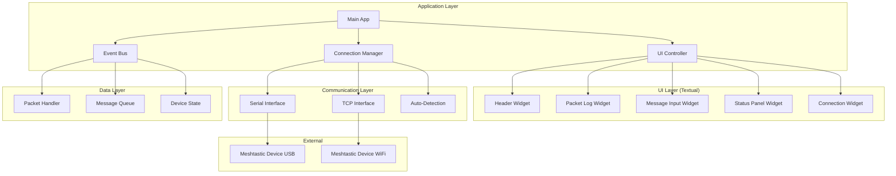
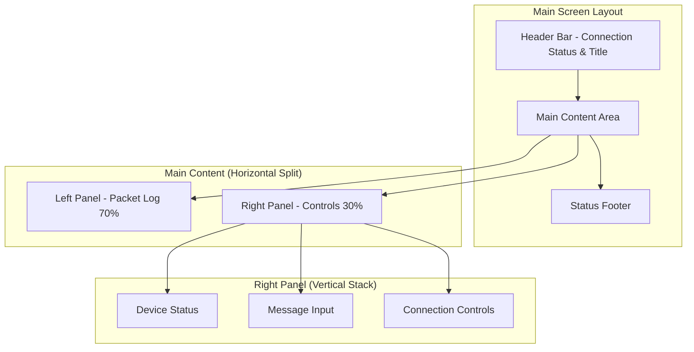

# Meshling TUI - Technical Architecture Plan

## Project Overview

**Meshling** is a cross-platform terminal user interface for Meshtastic mesh networking devices, built with Python's Textual framework. The application provides real-time packet monitoring, message sending capabilities, and device status information with support for both serial/USB and TCP/WiFi connections.

## Core Requirements Summary

- **Cross-platform compatibility** (Linux, macOS, Windows)
- **Dual connection support** (Serial/USB + TCP/WiFi with auto-detection)
- **Real-time packet streaming** and message input
- **Device status monitoring** and basic configuration
- **Extensible architecture** for future feature additions
- **Robust error handling** and connection recovery

## System Architecture



## Detailed File Structure

```
meshling/
├── pyproject.toml              # Modern Python packaging
├── README.md                   # Installation and usage
├── LICENSE                     # MIT license
├── requirements.txt            # Dependencies
├── setup.py                    # Fallback setup
│
├── meshling/                   # Main package
│   ├── __init__.py
│   ├── main.py                 # Entry point and CLI
│   ├── app.py                  # Main Textual application
│   ├── config.py               # Configuration management
│   │
│   ├── core/                   # Core business logic
│   │   ├── __init__.py
│   │   ├── connection_manager.py    # Connection abstraction
│   │   ├── packet_handler.py       # Packet processing
│   │   ├── message_queue.py        # Message management
│   │   ├── device_state.py         # Device status tracking
│   │   └── event_bus.py            # Internal event system
│   │
│   ├── interfaces/             # Meshtastic communication
│   │   ├── __init__.py
│   │   ├── base_interface.py       # Abstract interface
│   │   ├── serial_interface.py     # USB/Serial connection
│   │   ├── tcp_interface.py        # WiFi/TCP connection
│   │   └── auto_detector.py        # Connection auto-detection
│   │
│   ├── ui/                     # Textual UI components
│   │   ├── __init__.py
│   │   ├── widgets/
│   │   │   ├── __init__.py
│   │   │   ├── header.py           # App header/title
│   │   │   ├── packet_log.py       # Live packet display
│   │   │   ├── message_input.py    # Message composition
│   │   │   ├── status_panel.py     # Device status
│   │   │   ├── connection_panel.py # Connection management
│   │   │   └── base_widget.py      # Common widget functionality
│   │   │
│   │   ├── screens/
│   │   │   ├── __init__.py
│   │   │   ├── main_screen.py      # Primary interface
│   │   │   ├── connection_screen.py # Connection setup
│   │   │   └── settings_screen.py   # Future: configuration
│   │   │
│   │   └── styles/
│   │       ├── __init__.py
│   │       ├── main.tcss           # Main stylesheet
│   │       └── themes.py           # Theme management
│   │
│   └── utils/                  # Utilities and helpers
│       ├── __init__.py
│       ├── logging.py              # Logging configuration
│       ├── exceptions.py           # Custom exceptions
│       ├── validators.py           # Input validation
│       └── formatters.py           # Data formatting
│
├── tests/                      # Test suite
│   ├── __init__.py
│   ├── test_connection_manager.py
│   ├── test_packet_handler.py
│   ├── test_interfaces.py
│   └── test_ui_widgets.py
│
├── docs/                       # Documentation
│   ├── installation.md
│   ├── usage.md
│   ├── development.md
│   └── architecture.md
│
└── scripts/                    # Development scripts
    ├── build.py                # Build automation
    ├── test.py                 # Test runner
    └── package.py              # Packaging script
```

## Core Component Design

### 1. Connection Manager (`core/connection_manager.py`)

```python
class ConnectionManager:
    """Manages Meshtastic device connections with auto-detection"""
    
    async def auto_detect_connection(self) -> Optional[BaseInterface]
    async def connect_serial(self, port: str) -> SerialInterface
    async def connect_tcp(self, host: str, port: int) -> TCPInterface
    async def disconnect(self)
    def get_connection_status(self) -> ConnectionStatus
```

### 2. Packet Handler (`core/packet_handler.py`)

```python
class PacketHandler:
    """Processes incoming Meshtastic packets"""
    
    def register_packet_callback(self, callback: Callable)
    def process_packet(self, packet: MeshPacket)
    def format_packet_display(self, packet: MeshPacket) -> str
    def filter_packets(self, filters: PacketFilters) -> List[MeshPacket]
```

### 3. Main UI Layout



## Development Phases

### Phase 1: Foundation (MVP Core)
**Goal**: Basic functional TUI with core messaging

**Tasks**:
1. **Project Setup**
   - Initialize Python package structure
   - Configure `pyproject.toml` with dependencies
   - Set up basic CLI entry point

2. **Core Infrastructure**
   - Implement `BaseInterface` abstraction
   - Create `SerialInterface` for USB connections
   - Build basic `ConnectionManager`
   - Set up event bus system

3. **Basic UI Framework**
   - Create main Textual application shell
   - Implement basic packet log widget
   - Add simple message input widget
   - Design initial CSS styling

4. **Integration & Testing**
   - Connect Meshtastic library to UI
   - Implement packet streaming
   - Add basic error handling
   - Test with real device

**Deliverables**: Working TUI that can connect via USB, display packets, send messages

### Phase 2: Enhanced Connectivity
**Goal**: Multi-connection support and robustness

**Tasks**:
1. **TCP/WiFi Support**
   - Implement `TCPInterface`
   - Add connection auto-detection
   - Create connection selection UI

2. **Improved Error Handling**
   - Add connection recovery logic
   - Implement graceful disconnection
   - Add user-friendly error messages

3. **Enhanced UI**
   - Improve packet log formatting
   - Add device status panel
   - Implement connection status indicators

**Deliverables**: Robust multi-connection TUI with auto-detection

### Phase 3: Polish & Extensibility
**Goal**: Production-ready with extension points

**Tasks**:
1. **Cross-Platform Testing**
   - Test on Linux, macOS, Windows
   - Resolve platform-specific issues
   - Optimize performance

2. **Extensibility Framework**
   - Create plugin architecture foundation
   - Add configuration system
   - Implement theme support

3. **Documentation & Packaging**
   - Complete user documentation
   - Set up automated builds
   - Prepare for distribution

**Deliverables**: Production-ready, cross-platform TUI

## Key Technical Decisions

### 1. **Textual Framework Choice**
- **Pros**: Modern, reactive, CSS-like styling, excellent documentation
- **Cons**: Newer library, smaller ecosystem
- **Decision**: Proceed with Textual for its superior developer experience

### 2. **Async Architecture**
- Use `asyncio` throughout for non-blocking packet handling
- Textual's async support enables smooth UI updates
- Background tasks for connection monitoring

### 3. **Event-Driven Design**
- Internal event bus for loose coupling
- Widgets subscribe to relevant events
- Easy to extend with new features

### 4. **Connection Abstraction**
- Common interface for serial and TCP connections
- Auto-detection reduces user friction
- Graceful fallback mechanisms

## Dependencies

### Core Dependencies
```toml
[tool.poetry.dependencies]
python = "^3.8"
textual = "^0.45.0"
meshtastic = "^2.3.0"
pyserial = "^3.5"
click = "^8.1.0"
pydantic = "^2.5.0"
```

### Development Dependencies
```toml
[tool.poetry.group.dev.dependencies]
pytest = "^7.4.0"
pytest-asyncio = "^0.21.0"
black = "^23.0.0"
mypy = "^1.7.0"
textual-dev = "^1.2.0"
```

## Cross-Platform Considerations

### **Windows**
- Use `pyserial` for COM port detection
- Handle Windows-specific path separators
- Test with Windows Terminal and PowerShell

### **macOS**
- Handle `/dev/tty.usbserial-*` device paths
- Test with Terminal.app and iTerm2
- Consider code signing for distribution

### **Linux**
- Support various `/dev/ttyUSB*` and `/dev/ttyACM*` devices
- Handle permissions for serial port access
- Test across different distributions

## Future Extension Points

The extensible architecture supports:

1. **Plugin System**: Module-based feature additions
2. **Advanced Configuration**: Device parameter management
3. **Multiple Themes**: Dark/light/custom color schemes
4. **Packet Filtering**: Advanced search and filtering
5. **Message History**: Persistent conversation storage
6. **Network Topology**: Mesh network visualization
7. **Scripting Interface**: Automation and custom commands

## Risk Mitigation

### **Technical Risks**
- **Meshtastic API Changes**: Pin specific versions, monitor releases
- **Cross-Platform Issues**: Extensive testing, CI/CD pipeline
- **Performance**: Async design, packet rate limiting

### **User Experience Risks**
- **Connection Complexity**: Auto-detection, clear error messages
- **Learning Curve**: Comprehensive documentation, intuitive UI

This architecture provides a solid foundation for a professional-grade Meshtastic TUI while maintaining the flexibility to grow with user needs and feature requests.